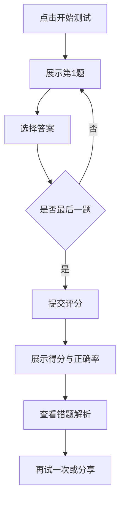

# 产品需求文档（PRD）：垃圾分类科普网站

## 1. 产品概述

本项目为中国矿业大学"环保A7142小分队"2026年暑期社会实践成果展示平台，旨在打造一个集**垃圾分类知识科普、互动学习、调研成果展示、宣传作品传播**于一体的可视化网站。
- **核心目标**：响应"垃圾分类就是新时尚"号召，普及四分类标准与源头减量方法，提升大学生与社区居民的分类意识与参与度。
- **目标用户**：高校学生、社区居民、关注环保的公众用户，以及社会实践评审教师。
- **社会价值**：将团队查阅资料、问卷调研、海报视频制作、调研报告等实践成果系统化呈现，形成可传播、可复用的环保科普资源。

## 2. 核心功能

### 2.1 用户角色

| 角色 | 访问方式 | 核心权限 |
|------|----------|----------|
| 普通访客 | 直接访问 | 浏览科普内容、参与互动测试、查看调研成果与宣传作品 |
| 团队成员 | 直接访问 | 同上（无需登录，所有内容公开） |

### 2.2 功能模块

1. **首页**：Hero 主视觉、团队介绍、实践主题、核心数据看板、快捷导航
2. **分类知识页**：四大垃圾类别详解、易混物品清单、源头减量技巧、分类指南搜索
3. **互动测试页**：垃圾分类小测验、实时评分与解析、错题回顾
4. **调研成果页**：问卷数据可视化图表、关键结论、调研报告下载
5. **宣传作品页**：宣传视频展示、电子海报画廊、新闻稿链接
6. **关于我们页**：团队介绍、日程安排、指导教师、联系方式

### 2.3 页面详情

| 页面名称 | 模块名称 | 功能描述 |
|----------|----------|----------|
| 首页 | Hero 主视觉 | 全屏主视觉，展示主题标语与团队 logo，滚动视差动画 |
| 首页 | 实践概览 | 实践时间、地点、成员、形式卡片化展示 |
| 首页 | 核心数据看板 | 问卷回收量、覆盖社区数、宣传作品数等关键指标动态计数 |
| 首页 | 快捷导航 | 四大分类入口 + 测试入口，悬浮卡片 hover 动效 |
| 分类知识页 | 四分类导览 | 可回收物、有害垃圾、厨余垃圾、其他垃圾四色分区展示 |
| 分类知识页 | 类别详情 | 投放要求、常见物品、处理流程、注意事项 |
| 分类知识页 | 易混清单 | 易混淆物品对比表（如：纸巾≠可回收、电池类别区分） |
| 分类知识页 | 减量技巧 | 源头减量生活小妙招卡片堆叠展示 |
| 分类知识页 | 智能搜索 | 按物品名称快速查询所属类别 |
| 互动测试页 | 测试介绍 | 测试规则说明与开始按钮 |
| 互动测试页 | 题目作答 | 单选题，四分类拖拽/点击选择，进度条显示 |
| 互动测试页 | 结果反馈 | 得分、正确率、错题解析、再试一次 |
| 调研成果页 | 数据概览 | 总样本量、地域分布、认知度等关键指标 |
| 调研成果页 | 图表展示 | 分类认知柱状图、行为习惯饼图、问题痛点词云 |
| 调研成果页 | 核心结论 | 文字版调研发现与建议 |
| 调研成果页 | 报告下载 | 调研报告 PDF 下载入口 |
| 宣传作品页 | 视频展示 | 宣传视频播放器，3-5 分钟科普短片 |
| 宣传作品页 | 海报画廊 | 至少 3 张电子海报瀑布流展示，点击放大 |
| 宣传作品页 | 新闻稿件 | 新闻稿列表与外部投稿链接 |
| 关于我们页 | 团队介绍 | 四位成员卡片（姓名、分工、专业班级） |
| 关于我们页 | 日程安排 | 7.15-8.1 实践时间轴可视化 |
| 关于我们页 | 指导教师 | 史毛宁老师信息展示 |
| 关于我们页 | 联系方式 | 团队邮箱与队长电话（脱敏） |

## 3. 核心流程

### 3.1 访客学习流程

用户访问网站 → 浏览首页了解实践背景 → 进入分类知识页学习四分类标准 → 通过智能搜索查询具体物品 → 参与互动测试检验学习效果 → 查看错题解析巩固知识 → 浏览调研成果了解现状 → 观看宣传视频深化认知。

### 3.2 互动测试流程

开始测试 → 逐题作答 → 提交答案 → 系统评分 → 展示结果与解析 → 错题回顾 → 再试一次/分享成绩。

## 4. 用户界面设计

### 4.1 设计风格

- **整体调性**：自然生态 + 现代科技融合，体现"绿色低碳 × 数据驱动"的双重气质
- **主色调**：
  - 主色：森林绿 `#2D5F3F`（沉稳、生态）
  - 辅色：嫩芽绿 `#7BC47F`（生机、活力）
  - 强调色：明黄 `#F4C430`（警示、提醒，用于有害垃圾标识）
  - 中性色：米白 `#F8F6F0`（背景）、深炭 `#1A2E1A`（文字）
- **四分类专属色**：
  - 可回收物：蓝色 `#1E88E5`
  - 有害垃圾：红色 `#E53935`
  - 厨余垃圾：绿色 `#43A047`
  - 其他垃圾：灰色 `#757575`
- **按钮风格**：圆角胶囊按钮（border-radius: 999px），主按钮带柔和阴影与 hover 上浮效果
- **字体方案**：
  - 标题：思源宋体 `Noto Serif SC`（厚重文化感，呼应"生态文明"主题）
  - 正文：思源黑体 `Noto Sans SC`（清晰易读）
  - 数字：`Space Grotesk`（现代几何感，用于数据展示）
- **布局风格**：desktop-first，顶部固定导航 + 大屏分区滚动，卡片化模块 + 网格背景纹理
- **图标/emoji**：使用线性 SVG 图标为主，搭配垃圾分类相关符号（♻️ 🗑️ 🌱），克制使用

### 4.2 页面设计概览

| 页面名称 | 模块名称 | UI 元素 |
|----------|----------|----------|
| 首页 | Hero 主视觉 | 全屏视差背景（绿叶纹理 + 渐变），超大标题，团队 logo，滚动指示器 |
| 首页 | 实践概览 | 三栏卡片（时间/地点/成员），悬浮投影，图标点缀 |
| 首页 | 核心数据看板 | 大数字 + 进度环动画，计数器滚动效果，深绿背景反白 |
| 首页 | 快捷导航 | 2×3 网格卡片，四分类专属色 hover 边框，图标 + 文字 |
| 分类知识页 | 四分类导览 | 四列彩色色块，每列含图标、类别名、一句话描述，hover 展开详情 |
| 分类知识页 | 类别详情 | 左侧类别导航 + 右侧内容区，常见物品网格展示 |
| 分类知识页 | 易混清单 | 左右对比卡片，"❌ 错误" vs "✅ 正确"红绿对比 |
| 分类知识页 | 减量技巧 | 卡片堆叠横向滚动，每张卡片一个生活场景 |
| 分类知识页 | 智能搜索 | 顶部大搜索框，实时联想下拉，结果卡片高亮类别色 |
| 互动测试页 | 测试介绍 | 居中卡片，测试规则 + 开始按钮，背景粒子动画 |
| 互动测试页 | 题目作答 | 顶部进度条，居中题目卡片，四个选项色块按钮 |
| 互动测试页 | 结果反馈 | 大圆环进度（得分），错题列表手风琴展开 |
| 调研成果页 | 数据概览 | 四宫格大数字指标，动画计数 |
| 调研成果页 | 图表展示 | ECharts 图表卡片网格，柱状/饼图/词云 |
| 调研成果页 | 核心结论 | 引用样式卡片，左侧绿色竖线强调 |
| 调研成果页 | 报告下载 | 文档图标卡片，下载按钮 |
| 宣传作品页 | 视频展示 | 大尺寸视频播放器，自定义控制条，海报封面 |
| 宣传作品页 | 海报画廊 | 瀑布流 masonry 布局，hover 缩放 + 遮罩 |
| 宣传作品页 | 新闻稿件 | 列表卡片，标题 + 摘要 + 外链图标 |
| 关于我们页 | 团队介绍 | 四人头像卡片网格，hover 显示分工详情 |
| 关于我们页 | 日程安排 | 垂直时间轴，节点交替左右，日期 + 内容 |
| 关于我们页 | 指导教师 | 左右布局，头像 + 信息卡 |
| 关于我们页 | 联系方式 | 简洁信息卡，图标 + 文字 |

### 4.3 响应式设计

- **桌面优先**：1440px 基准设计稿，最小适配 1024px
- **平板适配**：768-1024px，网格自动从 3 列变 2 列，导航折叠为汉堡菜单
- **移动适配**：< 768px，单列布局，卡片堆叠，触摸优化（按钮最小 44px 触摸区）
- **触摸优化**：移动端关闭 hover 依赖交互，改用 tap；轮播支持手势滑动

### 4.4 视觉细节与氛围

- **背景纹理**：使用 SVG 噪点叠加 + 叶脉几何线条水印，避免纯色背景
- **装饰元素**：角落漂浮的叶子粒子动画（CSS only），分区交界处的波浪 SVG 分隔
- **滚动动效**：IntersectionObserver 触发模块淡入上移，stagger 错落动画
- **微交互**：按钮 hover 阴影上浮，卡片 hover 边框点亮，数字滚动计数
- **加载状态**：骨架屏 + 叶子旋转 loader
