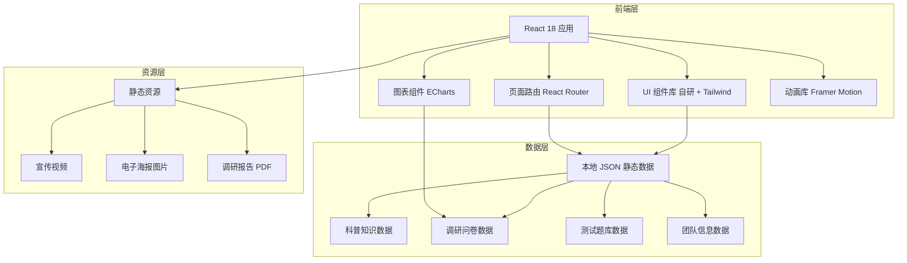

# 技术架构文档：垃圾分类科普网站

## 1. 架构设计

本项目为纯前端静态网站，无后端服务，数据通过本地 JSON 文件加载，适合社会实践成果展示场景，便于部署与传播。



## 2. 技术说明

- **前端框架**：React@18 + tailwindcss@3 + vite
- **初始化工具**：vite-init（`npm create vite@latest`）
- **路由**：React Router@6（客户端路由）
- **图表库**：ECharts@5（调研数据可视化）
- **动画库**：Framer Motion@11（页面过渡与微交互）
- **后端**：无（纯静态网站，数据通过 JSON 文件加载）
- **数据库**：无（使用本地 JSON 模拟数据）
- **构建工具**：Vite@5
- **部署方式**：静态托管（可部署至 GitHub Pages / Vercel / Netlify）

## 3. 路由定义

| 路由 | 页面名称 | 用途 |
|------|----------|------|
| `/` | 首页 | 主视觉、实践概览、数据看板、快捷导航 |
| `/knowledge` | 分类知识页 | 四分类标准、易混清单、减量技巧、智能搜索 |
| `/quiz` | 互动测试页 | 垃圾分类小测验、评分、错题解析 |
| `/research` | 调研成果页 | 问卷数据可视化、核心结论、报告下载 |
| `/gallery` | 宣传作品页 | 宣传视频、电子海报、新闻稿件 |
| `/about` | 关于我们页 | 团队介绍、日程安排、指导教师、联系方式 |

## 4. 数据结构定义

### 4.1 科普知识数据（knowledge.json）

```typescript
interface KnowledgeData {
  categories: Category[];
  confusingItems: ConfusingItem[];
  reductionTips: ReductionTip[];
}

interface Category {
  id: 'recyclable' | 'hazardous' | 'kitchen' | 'other';
  name: string;           // 如"可回收物"
  color: string;          // 专属色值
  icon: string;           // SVG 图标标识
  description: string;    // 一句话描述
  requirements: string;   // 投放要求
  commonItems: string[];  // 常见物品列表
  process: string[];      // 处理流程
  notes: string[];        // 注意事项
}

interface ConfusingItem {
  id: string;
  name: string;           // 如"纸巾"
  wrongCategory: string;  // 常被误投类别
  correctCategory: string;// 正确类别
  reason: string;         // 解析说明
}

interface ReductionTip {
  id: string;
  scene: string;          // 场景，如"厨房"
  tip: string;            // 减量技巧
  icon: string;
}
```

### 4.2 测试题库数据（quiz.json）

```typescript
interface QuizData {
  questions: Question[];
}

interface Question {
  id: number;
  question: string;       // 题干，如"用过的纸巾属于哪类垃圾？"
  options: {
    label: string;        // "可回收物"等
    value: CategoryId;
  }[];
  correctAnswer: CategoryId;
  explanation: string;    // 解析说明
}
```

### 4.3 调研数据（research.json）

```typescript
interface ResearchData {
  overview: {
    totalSamples: number;     // 总样本量
    coverageAreas: number;    // 覆盖社区数
    awarenessRate: number;    // 认知率（百分比）
    participationRate: number;// 参与率（百分比）
  };
  charts: {
    awarenessByCategory: ChartData;   // 四分类认知度柱状图
    behaviorHabits: ChartData;        // 行为习惯饼图
    painPoints: WordCloudData;        // 问题痛点词云
  };
  conclusions: Conclusion[];
  reportUrl: string;         // 调研报告 PDF 路径
}

interface ChartData {
  type: 'bar' | 'pie' | 'line';
  data: { name: string; value: number }[];
}

interface WordCloudData {
  data: { name: string; value: number }[];
}

interface Conclusion {
  id: number;
  title: string;
  content: string;
}
```

### 4.4 团队信息数据（team.json）

```typescript
interface TeamData {
  teamName: string;          // "环保A7142小分队"
  theme: string;             // "推动绿色发展，助力环境保护"
  members: Member[];
  schedule: ScheduleItem[];
  advisor: Advisor;
  contact: Contact;
}

interface Member {
  id: string;
  name: string;              // 姓名
  role: string;              // 队长/副队长/组员
  gender: string;
  college: string;           // 学院
  className: string;         // 专业班级
  phone: string;             // 脱敏电话
  responsibility: string;    // 分工
}

interface ScheduleItem {
  date: string;              // 如"7.15-7.16"
  location: string;          // 地点
  content: string;           // 内容
  members: string;           // 参加成员
}

interface Advisor {
  name: string;              // 史毛宁
  phone: string;
  unit: string;              // 中国矿业大学
  title: string;             // 专职辅导员、助教
}

interface Contact {
  email: string;
  leaderPhone: string;       // 队长电话（脱敏）
}
```

## 5. 项目目录结构

```
garbage-classification-website/
├── public/
│   ├── data/
│   │   ├── knowledge.json
│   │   ├── quiz.json
│   │   ├── research.json
│   │   └── team.json
│   ├── videos/
│   │   └── propaganda.mp4
│   ├── images/
│   │   ├── posters/
│   │   ├── team/
│   │   └── icons/
│   └── documents/
│       └── 调研报告.pdf
├── src/
│   ├── components/
│   │   ├── layout/
│   │   │   ├── Navbar.jsx
│   │   │   ├── Footer.jsx
│   │   │   └── Layout.jsx
│   │   ├── common/
│   │   │   ├── Card.jsx
│   │   │   ├── Button.jsx
│   │   │   ├── SectionTitle.jsx
│   │   │   └── Counter.jsx
│   │   ├── home/
│   │   ├── knowledge/
│   │   ├── quiz/
│   │   ├── research/
│   │   ├── gallery/
│   │   └── about/
│   ├── pages/
│   │   ├── Home.jsx
│   │   ├── Knowledge.jsx
│   │   ├── Quiz.jsx
│   │   ├── Research.jsx
│   │   ├── Gallery.jsx
│   │   └── About.jsx
│   ├── data/
│   │   └── useFetch.js       // 数据获取 hook
│   ├── styles/
│   │   └── global.css
│   ├── App.jsx
│   ├── main.jsx
│   └── router.jsx
├── index.html
├── package.json
├── tailwind.config.js
├── vite.config.js
└── README.md
```

## 6. 关键技术实现说明

### 6.1 数据加载策略

使用自定义 Hook `useFetch` 统一管理本地 JSON 数据加载，支持 loading/error 状态：

```javascript
const { data, loading, error } = useFetch('/data/knowledge.json');
```

### 6.2 图表渲染

调研成果页使用 ECharts 渲染柱状图、饼图与词云图，封装为 React 组件：

- `<BarChart data={...} />`
- `<PieChart data={...} />`
- `<WordCloud data={...} />`

### 6.3 动画方案

- **页面过渡**：Framer Motion `AnimatePresence` 实现路由切换淡入淡出
- **滚动触发**：`whileInView` 实现模块进入视口动画
- **数字计数**：`useMotionValue` + `animate` 实现数据看板计数动画
- **微交互**：按钮 hover、卡片 hover 使用 `whileHover` / `whileTap`

### 6.4 智能搜索实现

分类知识页的物品搜索使用前端模糊匹配，从 knowledge.json 的 `commonItems` 与 `confusingItems` 中检索，实时联想下拉。

### 6.5 测试逻辑

互动测试页状态管理使用 React `useState` + `useReducer`：
- 记录当前题号、用户作答、得分
- 提交后计算正确率，生成错题列表
- 支持再试一次（重置状态）
